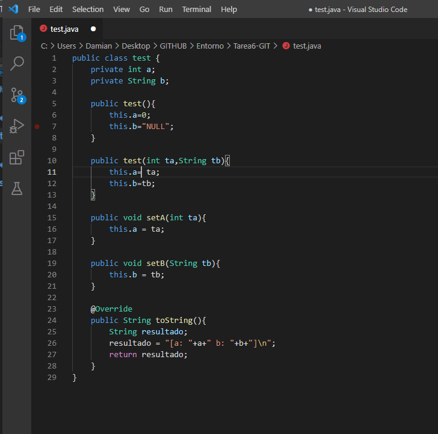
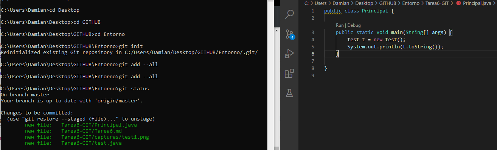
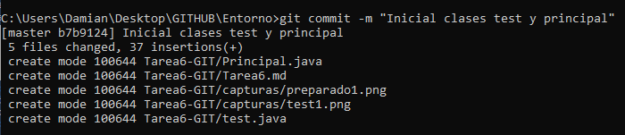

# **Tarea 6 REPASO GIT. MÉTODO TOSTRING EN JAVA**

**0. Inicializad bien vuestro repositorio de Entornos si lo tenéis o bien la carpeta Tarea6-GIT.**

**1. Cread un fichero test.java con la clase test como sigue:**

**2. Pasad a preparado el fichero.**

**3. Cread el fichero Principal.java**

**4. Pasad a preparado el fichero**

**5. Haced un commit con el comentario “Inicial clases test y principal”**

