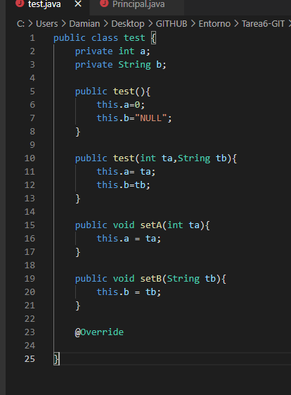

# **Tarea 6 REPASO GIT. MÉTODO TOSTRING EN JAVA**

**0. Inicializad bien vuestro repositorio de Entornos si lo tenéis o bien la carpeta Tarea6-GIT.**

**1. Cread un fichero test.java con la clase test como sigue:**

**2. Pasad a preparado el fichero.**

**3. Cread el fichero Principal.java.**

**4. Pasad a preparado el fichero.**

**5. Haced un commit con el comentario “Inicial clases test y principal”.**

**6. Comprobad la salida del programa. (debéis compilar los .java y probar el Principal).**

**7. Modificad el fichero test eliminando el método toString().**

**8. Pasad a preparado el fichero.**

**9. Realizad un segundo commit “Eliminada ToString()”.**

**10. Comprobad de nuevo la salida del programa.**

**11. Volved atrás viendo los “log” y haciendo “checkout” necesarios para que la salida del programa sea la del paso 6. Responded a las preguntas en el markdown: ¿Qué creéis que hace el método toString? Y ¿Qué conseguimos con el @Override?**

El metodo toString devuelve los resultados de "a" y "b".

Con @Override forzamos al compilador a comprobar en tiempo de compilación que estás sobrescribiendo correctamente un método, y de este modo evitar errores en tiempo de ejecución, los cuales serían mucho más difíciles de detectar.

