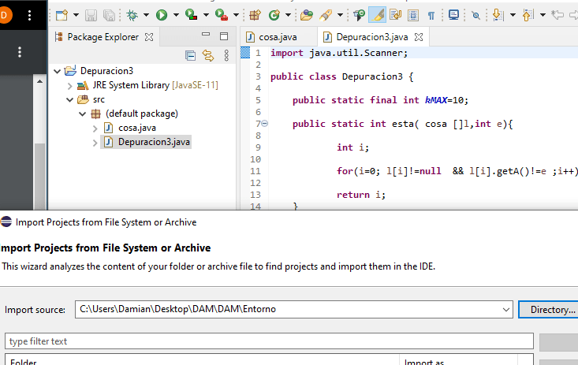

# Tarea 6: Depuración 3
**0. Importar el proyecto en vuestro WorkSpace de Eclipse.**

**1. Explicar QUÉ HACE EL MÉTODO MAIN.**

*Podéis poner líneas de código (prints) para ver cómo quedan las variables del programa, por ejemplo el vector.*

Declara las variables y crea un array. Luego entramos en un bucle y pide un número, este devolvera "A = "número introducido"" y "B = "cantidad de veces que has introducido ese número"", siempre que "B" sea mayor que 1.

**2. Poner un punto de ruptura (breakpoint) en la línea 26 (primer bucle del método main) y, basándoos en los valores que van tomando las variables, explicad qué hace y cómo funciona el método. Podéis crear tablas para ver cómo cambian los valores de las variables y del array.**

Primero pedirá que introduzcas un número por teclado, luego igualará "enc" a la posición del bucle donde guarde el número introducido. Se recorrerá el bucle y si el número introducido no está se guardará en una posición y no mostrará nada, si ya habías introducido ese número el programa guardará el número y devolverá la cantidad de veces que lo has introducido.

Por ejemplo: Si has introducido dos veces el 4, la segunda vez que introduzcas el 4 el programa devolverá:

A: 4, B: 2.

Si vuelves a introducir el 4 el programa devolverá:

A: 4, B: 3.

**3. Basándoos en el funcionamiento, determinad qué indican o a qué hacen referencia las variables “a” y “b” de la clase “cosa”.**

"a" hace referencia al número que se introduce por teclado y "b" hace referencia a la cantidad de veces que introduces un mismo número.
Cuando introduces un número "a" es igual a "a" y "b" es igual a "1" y cuando vuelves a introducir el mismo número "b" suma "1".

