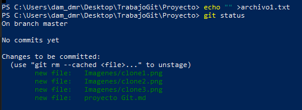
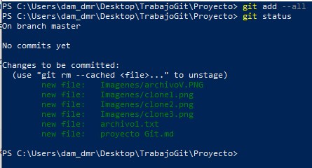
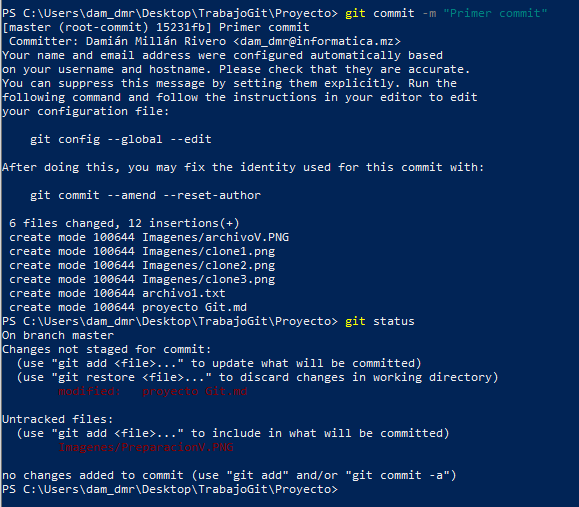
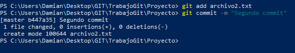
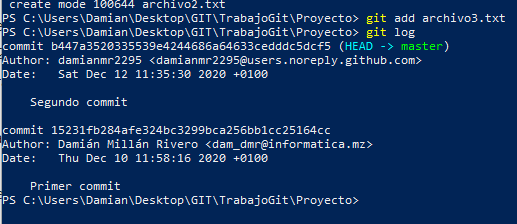
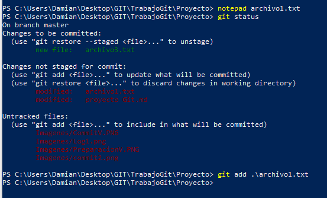
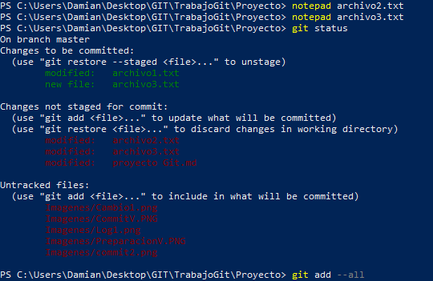
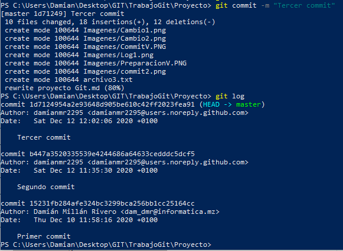

##### Clonamos el proyecto.
!
##### inicializamos el directorio.

##### añadimos los ficheros y preparamos.

##### 3. Cread un primer archivo "archivo1.txt". 4. Visuaalizad el estado del proyecto

##### 5. Pasad el archivo del espacio de trabajo a la zona de preparación. 6. Visualizad de nuevo el estado del proyecto.

##### 7. Realizad el primer commit y visualizad de nuevo el estado del proyecto.

##### 8. Cread dos archivos más al proyecto. "archivo2.txt" y "archivo3.txt". 9. Pasad el segundo archivo a la zona de preparación. 10. Segundo commit del proyecto.

##### 11.Añadod el último archivo a la zona de preparación. 12. Mostrad el log de todos los cambios.

##### 13. Cambiad el archivo "archivo1.txt" y verificad el estado de git. 14. Pasad el arvhivo a la zona de preparación.

##### 15. Modificad los archivos 2 y 3 del proyecto. Verificad estado del git. 16. Pasad los archivos 2 y 3 a la zona de preparación.

##### 17. Realizar el commit de los cambios realizados. 18. Mostrad el log de todos los cambios.

