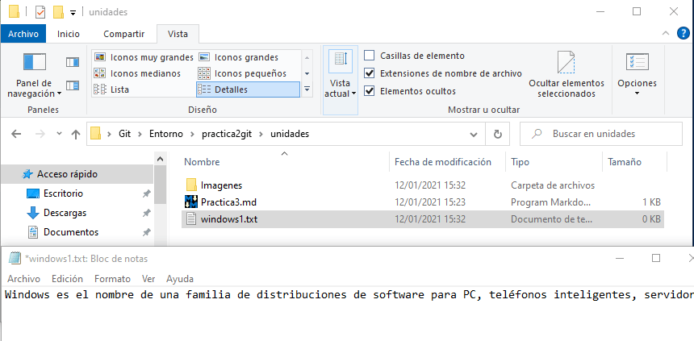
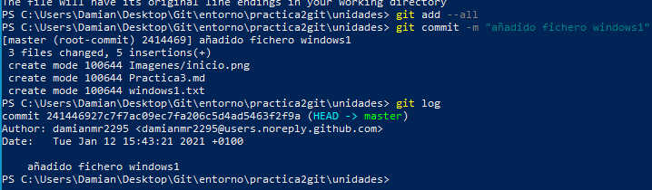
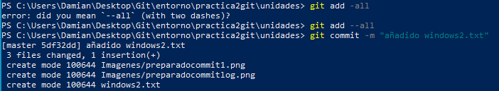
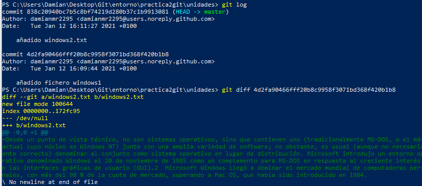
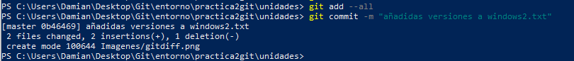
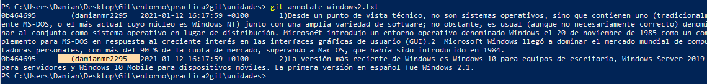

1. Entra en el directorio de la práctica2 (practica2git) y a partir de ahí realizaremos esta práctica.
2. Crea la carpeta "unidades" y dentro de ella un fichero llamado windows1.txt con el siguiente texto:
- Windows es el nombre de una familia de distribuciones de software para PC, teléfonos inteligentes, servidores y sistemas empotrados, desarrollados y vendidos por Microsoft y disponibles para múltiples arquitecturas, tales como x86, x86-64 y ARM.

3. Añade los cambios realizados a la zona de preparado.
4. Hacer un commit con el comentario "Añadido fichero windows1". 
5. Mostrar de nuevo el historial de cambios del repositorio.

6. Creal el fichero "windows2.txt" dentro de "unidades" con el texto:

- Desde un punto de vista técnico, no son sistemas operativos, sino que contienen uno (tradicionalmente MS-DOS, o el más actual cuyo núcleo es Windows NT) junto con una amplia variedad de software; no obstante, es usual (aunque no necesariamente correcto) denominar al conjunto como sistema operativo en lugar de distribución. Microsoft introdujo un entorno operativo denominado Windows el 20 de noviembre de 1985 como un complemento para MS-DOS en respuesta al creciente interés en las interfaces gráficas de usuario (GUI).2​ Microsoft Windows llegó a dominar el mercado mundial de computadoras personales, con más del 90 % de la cuota de mercado, superando a Mac OS, que había sido introducido en 1984.

7. Añade los cambios a la zona de preparado.
8. Hacer commit de cambios con el comentario "añadido windows2.txt".

9. Mostrad las diferencias entre los dos últimos commits (Esto se explica en clase).

10. Añade al fichero windows2.txt las lineas:
- La versión más reciente de Windows es Windows 10 para equipos de escritorio, Windows Server 2019 para servidores y Windows 10 Mobile para dispositivos móviles. La primera versión en español fue Windows 2.1.
11. Añade los cambios a la zona de preparado.
12. Commit de los cambios con el comentario "Añadidas versiones a windows2.txt".

13. Mostrad quien ha hecho cambios en el fichero windows2.txt.

